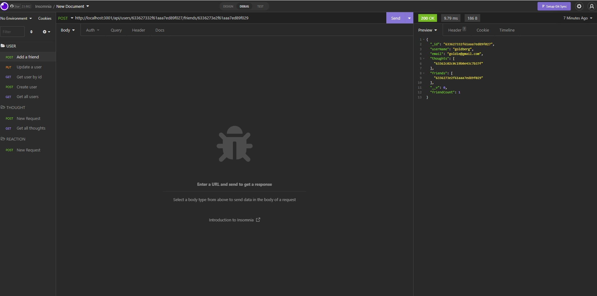
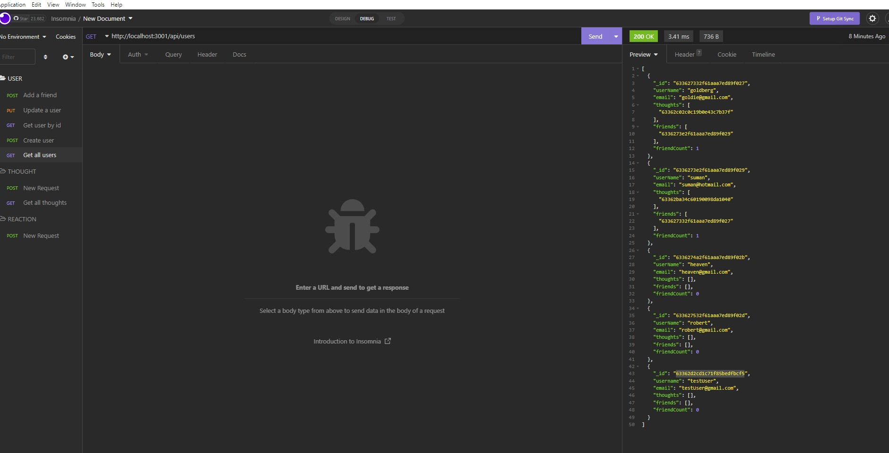
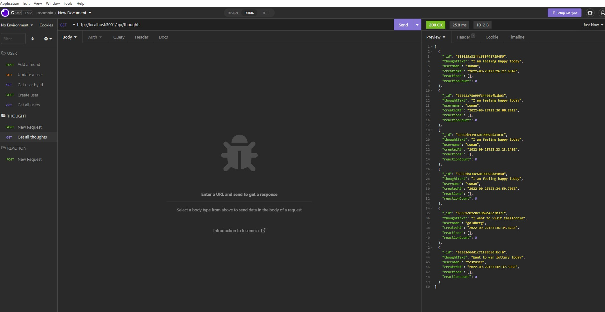

# Social Media API

## Description

Backend API of the Social Media Application to add user, friends, thoughts and reactions.

## Table of contents

- [Installation](#Installation)
- [Usage](#Usage)
- [Contribution](#Contribution)
- [Questions](#Questions)
- [Screenshots](#Screenshots)
- [Walkthrough](#Walkthrough)

## Installation

- npm i

## Usage

- node server

## Contribution

Sumit Ojha

## Questions

- sumit.ojha.dev@gmail.com
- https://github.com/sumitsann

## Screenshots

## Walkthrough

https://www.youtube.com/watch?v=u8NEAEjgvC0
